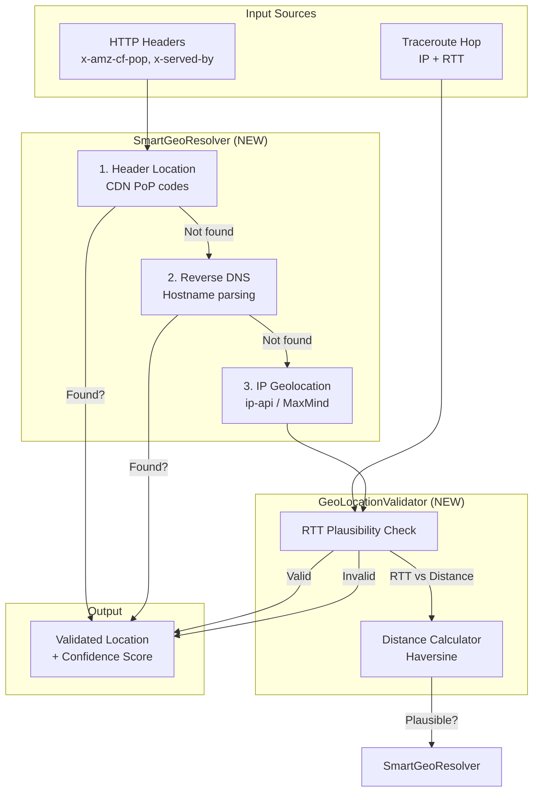

# Robuustere Geolocatie voor CDN Endpoints

## Doel
Verbeteren van geolocatie-nauwkeurigheid voor traceroute hops, met name CDN anycast IP's, door:
1. **RTT-validatie** - Fysiek onmogelijke locaties detecteren
2. **Multi-source fallback** - HTTP headers > Reverse DNS > IP Geolocation
3. **Shared codebase** - Dezelfde logica voor Electron en webapp, elk met eigen capabilities

## Architectuur Overzicht



## Gedetailleerd Plan

### Stap 1: Nieuwe `GeoLocationValidator` Service

**Bestand**: `app/app/src/services/geo/GeoLocationValidator.ts` (NIEUW)

**Functionaliteit**:
- `validateLocationByRtt(userLat, userLon, hopLat, hopLon, rttMs): ValidationResult`
- Berekent minimale RTT op basis van afstand (lichtsnelheid in fiber: ~100 km/ms round-trip)
- Retourneert confidence score: `valid`, `unlikely`, `impossible`

**Logica**:
```
theoreticalMinRtt = distance_km / 100  (conservatief)
if measured_rtt < theoreticalMinRtt * 0.3 → "impossible"
if measured_rtt < theoreticalMinRtt * 0.5 → "unlikely"  
else → "valid"
```

**Werkt in beide omgevingen**: Ja (pure berekening, geen platform-specifieke deps)

---

### Stap 2: Uitbreiden `IGeoProvider` Interface

**Bestand**: `app/app/src/services/geo/IGeoProvider.ts`

**Toevoegen**:
```typescript
export interface GeoLookupResult {
    // Bestaande velden...
    confidence?: 'high' | 'medium' | 'low';  // NEW
    source?: 'header' | 'dns' | 'ip-api' | 'maxmind';  // NEW
}

export interface EnhancedGeoLookupOptions {
    rttMs?: number;           // Voor validatie
    userLat?: number;         // Voor validatie
    userLon?: number;         // Voor validatie
    httpHeaders?: Record<string, string>;  // Electron only
    hostname?: string;        // Voor reverse DNS parsing
}
```

---

### Stap 3: Nieuwe `SmartGeoResolver` Service

**Bestand**: `app/app/src/services/geo/SmartGeoResolver.ts` (NIEUW)

**Functionaliteit**: Orchestreert de fallback chain met platform-aware logic

```typescript
class SmartGeoResolver {
    async resolveLocation(
        ip: string, 
        options: EnhancedGeoLookupOptions
    ): Promise<GeoLookupResult> {
        
        // 1. HTTP Headers (Electron: ALL headers, Webapp: limited CORS headers)
        if (options.httpHeaders) {
            const headerLoc = this.parseLocationFromHeaders(options.httpHeaders);
            if (headerLoc) return { ...headerLoc, confidence: 'high', source: 'header' };
        }
        
        // 2. Reverse DNS hostname parsing
        if (options.hostname) {
            const dnsLoc = this.parseLocationFromHostname(options.hostname);
            if (dnsLoc) return { ...dnsLoc, confidence: 'medium', source: 'dns' };
        }
        
        // 3. IP Geolocation (ip-api of MaxMind)
        const geoResult = await getGeoProvider().lookupIp(ip);
        
        // 4. Valideer met RTT als beschikbaar
        if (options.rttMs && options.userLat && options.userLon) {
            const validation = GeoLocationValidator.validateLocationByRtt(
                options.userLat, options.userLon,
                geoResult.latitude, geoResult.longitude,
                options.rttMs
            );
            
            if (validation === 'impossible') {
                geoResult.confidence = 'low';
                // Markeer als onbetrouwbaar, UI kan dit tonen
            }
        }
        
        return { ...geoResult, source: 'ip-api' };
    }
    
    // Header parsing (werkt met volledige headers in Electron, limited in webapp)
    private parseLocationFromHeaders(headers: Record<string, string>): Partial<GeoLookupResult> | null {
        // CloudFront
        const cfPop = headers['x-amz-cf-pop'];
        if (cfPop) return this.parseCloudFrontPop(cfPop);
        
        // Fastly
        const servedBy = headers['x-served-by'];
        if (servedBy) return this.parseFastlyServedBy(servedBy);
        
        // Cloudflare
        const cfRay = headers['cf-ray'];
        if (cfRay) return this.parseCloudflareRay(cfRay);
        
        return null;
    }
    
    // Hostname parsing (werkt altijd)
    private parseLocationFromHostname(hostname: string): Partial<GeoLookupResult> | null {
        // cache-ams21041-AMS.fastly.net → Amsterdam
        // server-52-84-125-47.ams50.r.cloudfront.net → Amsterdam
        const locationPatterns = [
            { pattern: /cache-([a-z]{3})\d+-([A-Z]{3})/i, extract: 2 },  // Fastly
            { pattern: /\.([a-z]{3})\d+\.r\.cloudfront\.net/i, extract: 1 },  // CloudFront
            // ... meer patterns
        ];
        // Return coords uit CDN_LOCATIONS lookup
    }
}
```

**Werkt in beide omgevingen**: Ja
- **Electron**: Krijgt volledige headers via IPC → header parsing werkt volledig
- **Webapp**: Krijgt beperkte headers (CORS) → valt terug op DNS/IP

---

### Stap 4: Integratie in `ElectronTopologyService`

**Bestand**: `app/app/src/services/ElectronTopologyService.ts`

**Wijzigingen**:
- Vervang directe `GeoLocationService.getLocationByIp()` calls door `SmartGeoResolver.resolveLocation()`
- Pas HTTP headers door aan resolver voor CDN endpoint
- Gebruik RTT van traceroute hop voor validatie

```typescript
// In geolocateHops()
const geoData = await SmartGeoResolver.resolveLocation(hop.ip, {
    rttMs: hop.rtt,
    userLat: userLocation.lat,
    userLon: userLocation.lon,
    hostname: hop.hostname,
    httpHeaders: lastHop ? capturedHeaders : undefined  // Alleen voor CDN endpoint
});

// In buildTopologyFromTraceroute()
// Toon confidence indicator in UI als geoData.confidence === 'low'
```

---

### Stap 5: Integratie in `DeepPacketAnalyser` (Webapp fallback)

**Bestand**: `app/app/src/services/DeepPacketAnalyser.ts`

**Wijzigingen**:
- In `analyze()` (browser path): Gebruik beschikbare headers voor locatie
- Geef headers door aan `SmartGeoResolver` waar mogelijk

---

### Stap 6: UI Confidence Indicator (Optioneel)

**Bestand**: `app/app/src/components/visualization/GeoMap.ts` of `PathNavigator.ts`

**Wijzigingen**:
- Toon indicator wanneer locatie `confidence: 'low'` heeft
- Bijv. stippellijn of "?" icoon bij onzekere hops

---

## Platform Capabilities Matrix

| Capability | Electron | Webapp |
|------------|----------|--------|
| HTTP Headers (ALL) | ✅ Via IPC | ❌ CORS limited |
| Traceroute RTT | ✅ Native mtr | ❌ Niet beschikbaar |
| Reverse DNS | ✅ Via traceroute hostname | ⚠️ Alleen als header exposed |
| IP Geolocation | ✅ ip-api / MaxMind | ✅ ip-api / MaxMind |
| RTT Validatie | ✅ Met traceroute data | ❌ Geen RTT data |
| Header-based CDN location | ✅ Full access | ⚠️ Alleen exposed headers |

---

## Bestanden Overzicht

| Actie | Bestand | Beschrijving |
|-------|---------|--------------|
| **NIEUW** | `app/app/src/services/geo/GeoLocationValidator.ts` | RTT-based validatie |
| **NIEUW** | `app/app/src/services/geo/SmartGeoResolver.ts` | Multi-source orchestrator |
| **WIJZIG** | `app/app/src/services/geo/IGeoProvider.ts` | Toevoegen confidence/source velden |
| **WIJZIG** | `app/app/src/services/ElectronTopologyService.ts` | Gebruik SmartGeoResolver |
| **WIJZIG** | `app/app/src/services/DeepPacketAnalyser.ts` | Doorsturen headers voor webapp |
| **OPTIONEEL** | UI componenten | Confidence indicator |

---

## Verificatie / Definition of Done

| Stap | Doel | Verificatie |
|------|------|-------------|
| 1 | RTT validatie werkt | Unit test: België user + 8ms RTT + "San Francisco" → `impossible` |
| 2 | Interface uitgebreid | TypeScript compileert zonder errors |
| 3 | SmartGeoResolver fallback chain | Test: header → dns → ip-api volgorde |
| 4 | Electron integratie | Traceroute toont correcte CDN locatie uit headers |
| 5 | Webapp integratie | Geen regressie, gebruikt beschikbare headers |
| 6 | UI indicator | Low-confidence hops visueel herkenbaar |

---

## Voordelen

1. **Electron**: Maximale nauwkeurigheid door HTTP headers + RTT validatie
2. **Webapp**: Verbeterde nauwkeurigheid waar CORS het toelaat, fallback naar bestaande logica
3. **Shared codebase**: `SmartGeoResolver` werkt in beide omgevingen met platform-specifieke inputs
4. **Transparantie**: Confidence score maakt onzekerheid zichtbaar voor gebruiker
5. **Geen externe dependencies**: Gebruikt bestaande ip-api/MaxMind + pure berekeningen
