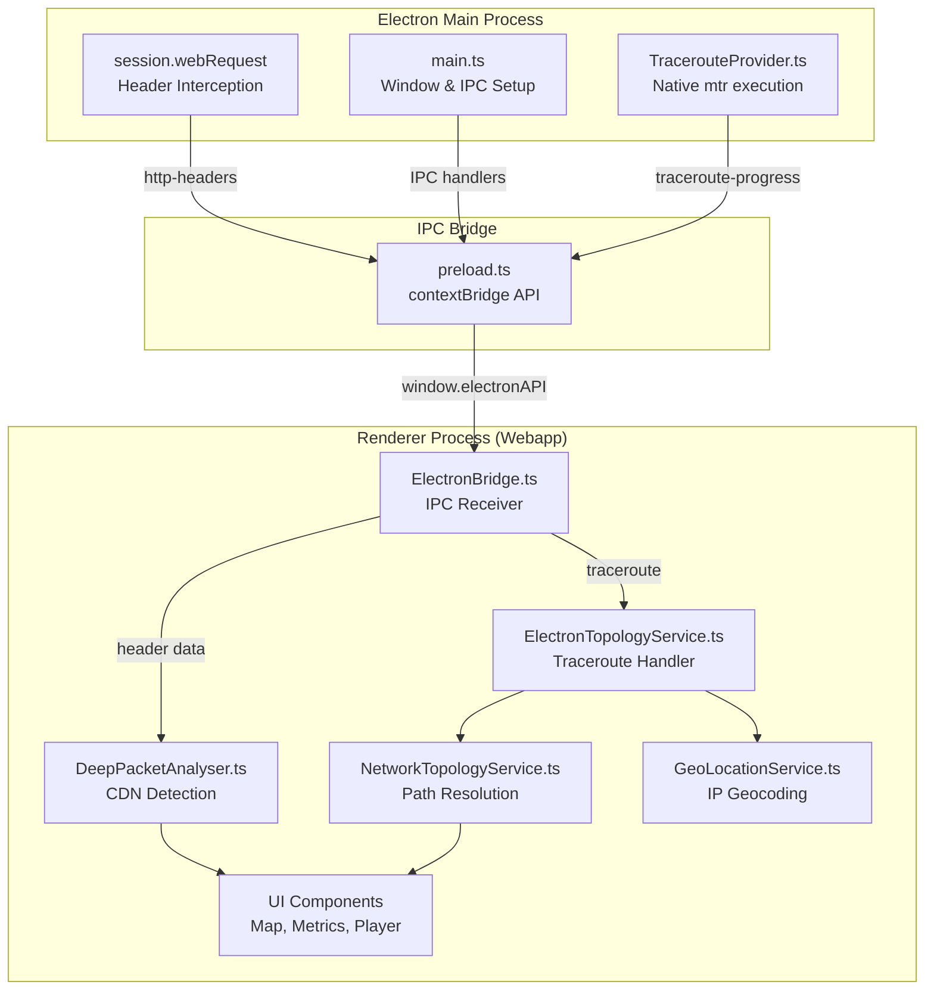

# AGENTS.md
This file provides guidance to Verdent when working with code in this repository.

## Table of Contents
1. Commonly Used Commands
2. High-Level Architecture & Structure
3. Key Rules & Constraints
4. Development Hints

## Commands

### Development
- `npm run dev` - Start both Vite dev server (webapp) and Electron in dev mode (opens DevTools)
- `npm run dev:vite` - Start only Vite dev server on port 5173
- `npm run dev:electron` - Wait for Vite, compile TypeScript, run Electron

### Build & Compile
- `npm run compile` - Compile TypeScript for main/preload processes (preload.js → preload.cjs)
- `npm run build` - Full production build (webapp + Electron distributable)
- `npm run build:vite` - Build webapp only (outputs to `app/app/dist`)
- `npm run build:electron` - Compile TypeScript and package with electron-builder (outputs to `release/`)

### Testing
- No automated tests configured [inferred]

### Git Submodule
- `git submodule update --remote --merge` - Sync webapp submodule to latest commit
- `cd app && git status` - Check submodule's git state

## Architecture

### Major Subsystems

**Electron Shell (Root)**
- **Main Process** (`src/main/`) - Node.js process managing window lifecycle, HTTP header interception, IPC handlers
- **Preload Script** (`src/main/preload.ts`) - Secure bridge between main and renderer processes via `contextBridge`

**Webapp (Git Submodule at `app/`)**
- **Renderer Process** (`app/app/src/`) - Vite + TypeScript web application loaded in Electron's BrowserWindow
- **Services** - Singleton services for CDN detection, network topology, geolocation, traceroute integration
- **Components** - UI components including player, metrics, maps, scenario views (BakeOffView, ContentSteering)

### Key Data Flows

#### HTTP Header Capture Flow
```
Video segment request
  ↓
[Main Process] session.webRequest.onHeadersReceived() captures ALL headers (no CORS)
  ↓
IPC: webContents.send('http-headers', {url, headers, statusCode, ttfb})
  ↓
[Preload] ipcRenderer.on('http-headers') → exposes via window.electronAPI.onHttpHeaders()
  ↓
[ElectronBridge.ts] subscribes to window.electronAPI.onHttpHeaders()
  ↓
[DeepPacketAnalyser.ts] analyzeFromElectron() detects CDN, notifies listeners
  ↓
UI updates (metrics, map visualization)
```

#### Traceroute Flow
```
User starts stream
  ↓
[ElectronTopologyService.ts] calls window.electronAPI.runTraceroute(hostname)
  ↓
IPC: ipcRenderer.invoke('traceroute', hostname)
  ↓
[Main Process] TracerouteProvider.runTracerouteStreaming() executes native `mtr`
  ↓
IPC: Streams 'traceroute-progress' events back to renderer
  ↓
[ElectronTopologyService.ts] resolves topology with real hops, geocodes IPs
  ↓
GeoMap renders network path visualization
```

### External Dependencies
- **Electron 33.x** - Desktop shell with CORS bypass (webSecurity: false)
- **Vite** - Web app bundler
- **Native Tools** - `mtr` (traceroute), `dig`/`host` (DNS lookup)
- **Webapp Stack** - THEOplayer, Shaka Player, Video.js, Chart.js, Leaflet.js

### Development Entry Points
- **Electron Main**: `src/main/main.ts` - Window creation, IPC setup
- **Webapp**: `app/app/src/main.ts` - React/TypeScript app initialization
- **IPC Bridge**: `app/app/src/services/ElectronBridge.ts` - Renderer-side IPC handler

### Subsystem Relationships



## Key Rules & Constraints

### Code Organization
- **Webapp is a git submodule** at `app/` - Always sync with `git submodule update --remote --merge`
- **Branching strategy**: Main repo branch should match submodule branch (main→main, develop→develop, feature/xyz→feature/xyz)

### Bundle Optimization (CRITICAL)
- **Electron-specific code must use dynamic imports** to prevent bloating webapp bundle
- The `app/` submodule is shared between Electron and web deployments
- **BAD**: `import { ElectronBridge } from './ElectronBridge'` (adds ~736 lines to webapp)
- **GOOD**: `if (isElectron()) { const { ElectronBridge } = await import('./ElectronBridge'); }`
- See `app/docs/ELECTRON_BUNDLE_OPTIMIZATION.md` for full guide

### Module System
- **Main process**: CommonJS (`tsconfig.main.json` with `"module": "CommonJS"`)
- **Preload script**: CommonJS, compiled to `.cjs` extension (`preload.js` → `preload.cjs`)
- **Webapp**: ES Modules (Vite handles bundling)

### Security
- **webSecurity disabled intentionally** to bypass CORS restrictions (main purpose of Electron wrapper)
- Never commit secrets or API keys
- Document complex functions, especially those handling IPC or native processes

### Git Operations
- **Use GitHub MCP** for all git operations instead of shell commands (when available)
- **Only commit when explicitly requested by the user**

### CDN Detection Logic
Located in `app/app/src/services/DeepPacketAnalyser.ts`:
- `x-cdn: oli` → o|i
- `x-cdn: akamai` or `Server: AkamaiGHost` → Akamai
- `x-cdn: gcore` → G-Core
- `x-cdn: fastly` or `Server: *Varnish*` → Fastly
- `Server: MediaPackage` or `x-amz-cf-pop` present → AWS
- URL contains `telenet-ops.be` → Telenet

### Smart Geolocation Strategy
Located in `app/app/src/services/geo/SmartGeoResolver.ts` and `GeoLocationValidator.ts`:
- **Tier 1: Headers** (IATA codes in `x-amz-cf-pop`, `cf-ray`, `x-served-by`)
- **Tier 2: DNS** (Location patterns in reverse DNS hostnames)
- **Tier 3: IP Geo** (MaxMind/IP-API baseline)
- **Validation**: Round-Trip Time (RTT) vs. Speed of Light check to prevent Anycast/Database errors.

### Environment Configuration
- `.env` - Development (localhost)
- `.env.production` - Production API URL (`https://server.lab.oli-cdn.io/api`)

## Development Hints

### Adding a New IPC Channel
1. Add IPC handler in `src/main/main.ts`:
   ```typescript
   ipcMain.handle('my-channel', async (event, arg) => {
       // Handle request
       return result;
   });
   ```
2. Expose in `src/main/preload.ts` via `contextBridge`:
   ```typescript
   contextBridge.exposeInMainWorld('electronAPI', {
       myMethod: (arg) => ipcRenderer.invoke('my-channel', arg)
   });
   ```
3. Use in webapp via `window.electronAPI`:
   ```typescript
   const result = await window.electronAPI.myMethod(arg);
   ```

### Adding a New CDN Detection Pattern
Edit `app/app/src/services/DeepPacketAnalyser.ts` in the `analyzeFromElectron()` method's CDN detection logic.

### Modifying the Build Process
- **Electron packaging**: Edit `electron-builder.yml`
- **Main/preload TypeScript**: Edit `tsconfig.main.json` / `tsconfig.preload.json`
- **Webapp bundling**: Edit `app/app/vite.config.ts`

### Working with the Submodule
1. **Starting a feature**:
   ```bash
   cd app
   git checkout develop
   git pull origin develop
   # Make changes, commit in app/
   git add . && git commit -m "feat: ..."
   git push origin develop
   cd ..
   git add app
   git commit -m "chore: update app submodule"
   ```
2. **Syncing latest webapp changes**:
   ```bash
   git submodule update --remote --merge
   ```

### Adding Native Node.js Functionality
- Implement in `src/main/` (main process has full Node.js access)
- Create IPC handler to expose to renderer
- Use `ElectronBridge.ts` to consume in webapp
- Example: See `TracerouteProvider.ts` for executing native commands

### Debugging
- **Development mode**: DevTools open automatically, check Console/Network tabs
- **Production mode**: Remove `mainWindow.webContents.openDevTools()` call
- **IPC communication**: Add `console.log()` in preload.ts and main.ts to trace messages
- **Header capture**: Check `session.webRequest.onHeadersReceived()` callback in main.ts

### Changing Default Scenario
Edit `app/app/src/main.ts` - change `currentScenario` default value (BakeOffView vs ContentSteering).
