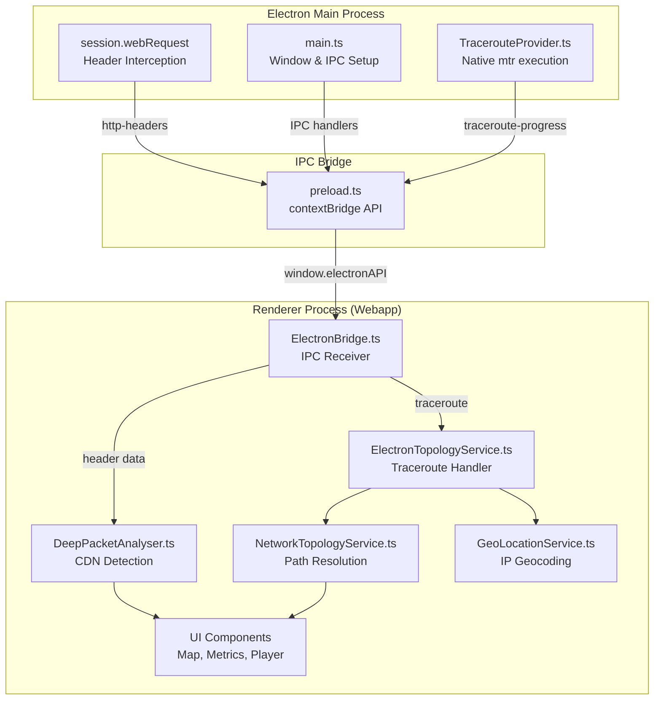

# AGENTS.md
This file provides guidance to AI agents when working with code in this repository.

> [!IMPORTANT]
> **Submodule Synchronization**: Before making any changes or answering questions about the web application logic, ALWAYS ensure the `app/` submodule is up to date by running:
> `git submodule update --remote --merge`

> [!TIP]
> **Keep Dependencies Fresh**: Periodically check for updates in all three layers (`.`, `app/app`, `app/server`) using `npm outdated`.
> - **Electron**: `npm outdated` (Root)
> - **Webapp**: `cd app/app && npm outdated`
> - **Server**: `cd app/server && npm outdated`

## Table of Contents
1. [Project Overview](#project-overview)
2. [Architecture](#architecture)
3. [Key Technologies](#key-technologies)
4. [Commands](#commands)
5. [Key Rules & Constraints](#key-rules--constraints)
6. [Critical Implementation Details](#critical-implementation-details)
7. [Module System](#module-system)
8. [Environment Configuration](#environment-configuration)
9. [Git Workflow](#git-workflow)
10. [Important Files](#important-files)
11. [Development Hints](#development-hints)

## Project Overview

This is an **Electron desktop application** wrapping the o|i CDN Demo webapp. The primary purpose is to bypass browser CORS restrictions and enable comprehensive network monitoring including full HTTP header capture.

## Architecture

```
oli-electron/                 # Electron shell
├── src/main/                 # Electron main process
│   ├── main.ts              # App entry, window creation, header capture
│   └── preload.ts           # IPC bridge to renderer (compiled to .cjs)
├── app/                      # Git submodule: o-i-demo webapp
│   └── app/src/
│       ├── services/
│       │   ├── DeepPacketAnalyser.ts   # CDN detection from headers
│       │   └── ElectronBridge.ts       # IPC receiver for Electron headers
│       └── components/scenarios/
│           ├── BakeOffView.ts          # Scenario A: Player comparison
│           └── ContentSteering.ts      # Scenario B: CDN orchestration
└── release/                  # Built DMG/app output
```

### Subsystem Relationships



### Key Data Flows

#### HTTP Header Capture Flow
```
Video segment request
  ↓
[Main Process] session.webRequest.onHeadersReceived() captures ALL headers (no CORS)
  ↓
IPC: webContents.send('http-headers', {url, headers, statusCode, ttfb})
  ↓
[Preload] ipcRenderer.on('http-headers') → exposes via window.electronAPI.onHttpHeaders()
  ↓
[ElectronBridge.ts] subscribes to window.electronAPI.onHttpHeaders()
  ↓
[DeepPacketAnalyser.ts] analyzeFromElectron() detects CDN, notifies listeners
  ↓
UI updates (metrics, map visualization)
```

#### Traceroute Flow
```
User starts stream
  ↓
[ElectronTopologyService.ts] calls window.electronAPI.runTraceroute(hostname)
  ↓
IPC: ipcRenderer.invoke('traceroute', hostname)
  ↓
[Main Process] TracerouteProvider.runTracerouteStreaming() executes native `mtr`
  ↓
IPC: Streams 'traceroute-progress' events back to renderer
  ↓
[ElectronTopologyService.ts] resolves topology with real hops, geocodes IPs
  ↓
GeoMap renders network path visualization
```

## Key Technologies

- **Electron 33.x** - Desktop shell with CORS bypass
- **TypeScript** - All source code
- **Vite** - Web app bundler
- **electron-builder** - Packaging
- **Native Tools** - `mtr` (traceroute), `dig`/`host` (DNS lookup)
- **Webapp Stack** - THEOplayer, Shaka Player, Video.js, Chart.js, Leaflet.js

## Commands

### Development
- `npm run dev` - Start both Vite dev server (webapp) and Electron in dev mode (opens DevTools)
- `npm run dev:vite` - Start only Vite dev server on port 5173
- `npm run dev:electron` - Wait for Vite, compile TypeScript, run Electron

### Build & Compile
- `npm run compile` - Compile TypeScript for main/preload processes (preload.js → preload.cjs)
- `npm run build` - Full production build (webapp + Electron distributable)
- `npm run build:vite` - Build webapp only (outputs to `app/app/dist`)
- `npm run build:electron` - Compile TypeScript and package with electron-builder (outputs to `release/`)

### Git Submodule
- `npm run submodule:init` - First-time clone setup (`--init --recursive`)
- `npm run submodule:update` - Pull latest from app/ remote (`--remote --merge`)
- `npm run submodule:status` - Show current submodule SHA and branch
- `bash .scripts/check-submodule.sh` - Verify app/ is on the same branch as main repo

### Testing
- No automated tests configured

## Key Rules & Constraints

### Code Organization
- **Webapp is a git submodule** at `app/` — Always sync with `git submodule update --remote --merge`
- **Branching strategy**: Main repo branch should match submodule branch (main→main, develop→develop, feature/xyz→feature/xyz)

### Bundle Optimization (CRITICAL)
- **Electron-specific code must use dynamic imports** to prevent bloating webapp bundle
- The `app/` submodule is shared between Electron and web deployments
- **BAD**: `import { ElectronBridge } from './ElectronBridge'` (adds ~736 lines to webapp)
- **GOOD**: `if (isElectron()) { const { ElectronBridge } = await import('./ElectronBridge'); }`
- **Allowed static import**: `import { isElectron } from './ElectronBridge'` — tiny guard function, tree-shakeable
- See `app/docs/ELECTRON_BUNDLE_OPTIMIZATION.md` for full guide

### Module System
- **Main process**: CommonJS (`tsconfig.main.json` with `"module": "CommonJS"`)
- **Preload script**: CommonJS, compiled to `.cjs` extension (`preload.js` → `preload.cjs`)
- **Webapp**: ES Modules (Vite handles bundling)

### Security
- **webSecurity disabled intentionally** to bypass CORS restrictions (main purpose of Electron wrapper)
- Never commit secrets or API keys
- Document complex functions, especially those handling IPC or native processes

### Git Operations
- **Use GitHub MCP** for all git operations instead of shell commands (when available)
- **Only commit when explicitly requested by the user**

## Critical Implementation Details

### Bundle Monitoring Tooling

| Tool | Command | Purpose |
|------|---------|---------|
| Bundle check script | `bash .scripts/check-bundle.sh` | Checks Electron leakage in main chunk, enforces 2.5 MB budget, lints static imports |
| Bundle check (no build) | `bash .scripts/check-bundle.sh --skip-build` | Same checks against existing `dist/` |
| Bundle visualizer | `cd app/app && npm run analyze` | Builds and opens `stats.html` (rollup-plugin-visualizer) |
| Pre-commit hook | Auto-runs on `git commit` | Blocks static imports of Electron modules in staged files |
| CI workflow | `.github/workflows/bundle-check.yml` | Runs bundle checks on PRs touching `app/app/src/` |

**Setup:** Run `bash .scripts/install-hooks.sh` after cloning to activate the pre-commit hook.

### IPC Channel Reference

All channels are registered in `setupIpcHandlers()` in `src/main/main.ts`.

| Direction | Channel | Type | Description |
|-----------|---------|------|-------------|
| main → renderer | `http-headers` | push | Every video response — headers, TTFB, statusCode |
| main → renderer | `traceroute-hop` | push | Each hop as discovered (streaming) |
| main → renderer | `traceroute-result` | push | Final traceroute result |
| main → renderer | `server-ip-resolved` | push | Resolved CDN server IP (deduplicated) |
| renderer → main | `run-traceroute` | `ipcMain.on` | Trigger traceroute for a hostname/URL |
| renderer → main | `set-custom-headers` | `ipcMain.on` | Inject custom headers into video requests |
| renderer → main | `clear-custom-headers` | `ipcMain.on` | Clear injected headers |
| renderer → main | `network:reset-cache` | `ipcMain.on` | Clear detected IP cache |
| renderer ↔ main | `get-public-ip` | `ipcMain.handle` | Returns public IPv4 from api.ipify.org |
| renderer ↔ main | `get-geolocation` | `ipcMain.handle` | Returns `null` (renderer's GeoLocationService handles via `navigator.geolocation`) |

### CDN Detection Logic

Located in `app/app/src/services/DeepPacketAnalyser.ts`, the `analyzeFromElectron()` method detects CDNs via:

| Header | CDN |
|--------|-----|
| `x-cdn: oli` | o\|i |
| `x-cdn: akamai` or `Server: AkamaiGHost` | Akamai |
| `x-cdn: gcore` | G-Core |
| `x-cdn: fastly` or `Server: *Varnish*` | Fastly |
| `Server: MediaPackage` or `x-amz-cf-pop` present | AWS |
| URL contains `telenet-ops.be` | Telenet |
| Any other `x-cdn` value | Uses header value directly |

### Location Parsing

- **CloudFront**: `x-amz-cf-pop` → `parseLocationFromCfPop()` (e.g., "AMS1" → "Amsterdam")
- **Fastly**: `x-served-by` → `parseLocationFromServedBy()` (e.g., "cache-ams..." → "Amsterdam")

### Smart Geolocation Strategy

Located in `app/app/src/services/geo/SmartGeoResolver.ts` and `GeoLocationValidator.ts`:
- **Tier 1: Headers** (IATA codes in `x-amz-cf-pop`, `cf-ray`, `x-served-by`)
- **Tier 2: DNS** (Location patterns in reverse DNS hostnames)
- **Tier 3: IP Geo** (MaxMind/IP-API baseline)
- **Validation**: Round-Trip Time (RTT) vs. Speed of Light check to prevent Anycast/Database errors.

## Environment Configuration

- `.env` - Development (localhost)
- `.env.production` - Production API URL (`https://server.lab.oli-cdn.io/api`)

## Git Workflow

- **main** - Production releases
- **develop** - Active development
- **feature/*** - Feature branches from develop

### Submodule Branching Strategy

**Critical**: The `app/` submodule has its own git repository with matching branch names.

**Rule:** Each branch in main repo should point to the **same-named branch** in the submodule:
```
oli-electron/                app/ submodule
─────────────────────────────────────────
main branch          →       main branch
develop branch       →       develop branch
feature/xyz branch   →       feature/xyz branch
```

**Workflow for new features:**
```bash
# 1. Start in app submodule
cd app
git checkout develop
git pull origin develop

# Make changes in app/, commit
git add .
git commit -m "feat: ..."
git push origin develop

# 2. Update main repo to point to new submodule commit
cd ..
git add app
git commit -m "chore: update app submodule"
git push origin develop
```

A **GitHub Actions workflow** (`.github/workflows/submodule-check.yml`) runs on push/PR to `main` and `develop` to catch branch misalignment in CI.

## Important Files

| File | Purpose |
|------|---------|
| `src/main/main.ts` | Header capture, window creation, IPC handlers |
| `src/main/preload.ts` | IPC bridge API (contextBridge → window.electronAPI) |
| `app/app/src/services/ElectronBridge.ts` | Receives headers and IPC responses from Electron |
| `app/app/src/services/DeepPacketAnalyser.ts` | CDN detection logic |
| `app/app/src/services/GeoLocationService.ts` | Hybrid GPS + IP geolocation (renderer-side) |
| `electron-builder.yml` | Build configuration |
| `.env.production` | API endpoints |
| `.scripts/check-submodule.sh` | Verifies app/ branch matches main repo branch |
| `.scripts/check-bundle.sh` | Bundle size budget + Electron leakage + static import checks |
| `.scripts/pre-commit` | Git pre-commit hook (blocks static Electron imports) |
| `.scripts/install-hooks.sh` | Installs git hooks (run after cloning) |
| `.github/workflows/submodule-check.yml` | CI workflow for submodule branch alignment |
| `.github/workflows/bundle-check.yml` | CI workflow for bundle size + leakage checks on PRs |

## Development Hints

### Adding a New IPC Channel
1. Add IPC handler in `src/main/main.ts`:
   ```typescript
   ipcMain.handle('my-channel', async (event, arg) => {
       // Handle request
       return result;
   });
   ```
2. Expose in `src/main/preload.ts` via `contextBridge`:
   ```typescript
   contextBridge.exposeInMainWorld('electronAPI', {
       myMethod: (arg) => ipcRenderer.invoke('my-channel', arg)
   });
   ```
3. Use in webapp via `window.electronAPI`:
   ```typescript
   const result = await window.electronAPI.myMethod(arg);
   ```

### Adding a New CDN Detection Pattern
Edit `app/app/src/services/DeepPacketAnalyser.ts` in the `analyzeFromElectron()` method's CDN detection logic.

### Modifying the Build Process
- **Electron packaging**: Edit `electron-builder.yml`
- **Main/preload TypeScript**: Edit `tsconfig.main.json` / `tsconfig.preload.json`
- **Webapp bundling**: Edit `app/app/vite.config.ts`

### Working with the Submodule
1. **Starting a feature**:
   ```bash
   cd app
   git checkout develop
   git pull origin develop
   # Make changes, commit in app/
   git add . && git commit -m "feat: ..."
   git push origin develop
   cd ..
   git add app
   git commit -m "chore: update app submodule"
   ```
2. **Syncing latest webapp changes**:
   ```bash
   git submodule update --remote --merge
   ```

### Adding Native Node.js Functionality
- Implement in `src/main/` (main process has full Node.js access)
- Create IPC handler to expose to renderer
- Use `ElectronBridge.ts` to consume in webapp
- Example: See `TracerouteProvider.ts` for executing native commands

### Change Default Scenario
Edit `app/app/src/main.ts` — change `currentScenario` default value (BakeOffView vs ContentSteering).

### Debugging
- **Development mode**: DevTools open automatically, check Console/Network tabs
- **Production mode**: Remove `mainWindow.webContents.openDevTools()` call
- **IPC communication**: Add `console.log()` in preload.ts and main.ts to trace messages
- **Header capture**: Check `session.webRequest.onHeadersReceived()` callback in main.ts
