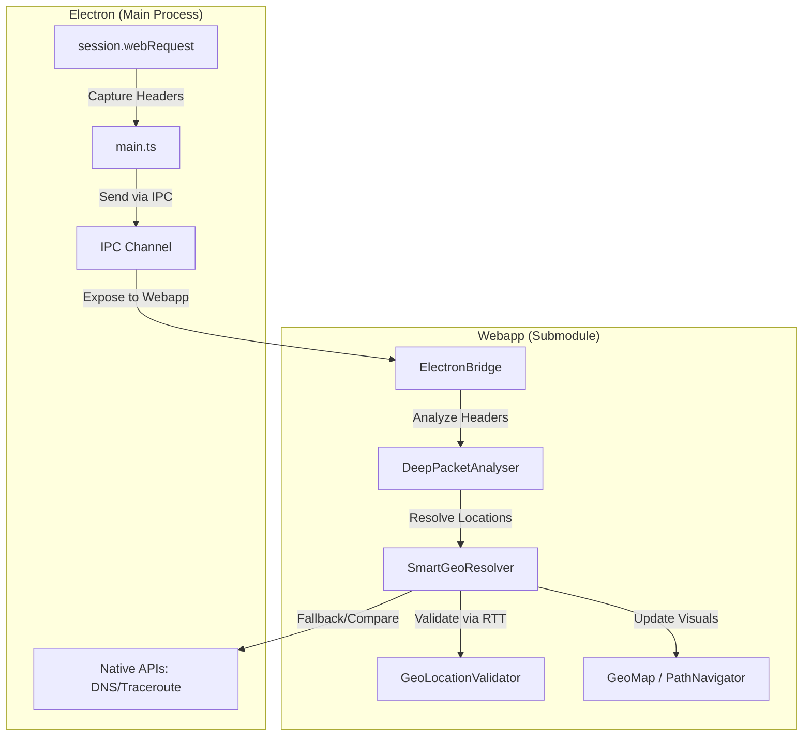

# o|i CDN Demo - Desktop App

A standalone desktop application for visualizing video streaming delivery paths and CDN performance.


## ⬇️ Download

**[Download the latest release](https://github.com/markminnoye/oli-electron/releases/latest)**

- **macOS (Apple Silicon)**: Download the `.dmg` file

### Resolving the "App is damaged" Error on macOS

Because this demo app is not signed with an Apple Developer certificate, macOS Gatekeeper may assign a quarantine attribute to the downloaded file. This results in an error message stating: **"oli CDN Demo is damaged and can't be opened. You should move it to the Trash."**

To bypass this security feature and allow the app to run, open an **Terminal** window and execute the following command after moving the app to your Applications folder:

```bash
xattr -cr "/Applications/oli CDN Demo.app"
```

_This command removes the `com.apple.quarantine` extended attribute, signaling to macOS that you trust the application._

## ✨ Features

### 🗺️ Network Path Visualization

- Real-time traceroute showing your video delivery path
- Geographic visualization of network hops on the map
- Click any hop to view details (location, latency, IP address)

### 📊 Performance Monitoring

- Live video quality metrics (bitrate, resolution, buffer health)
- CDN response times and HTTP headers
- Time to First Frame (TTFF) tracking

### 🔓 No Browser Restrictions

- Direct access to CDN manifests and segments (no CORS)
- Full HTTP header capture
- Real network traceroute via native `mtr` integration

## 🚀 Getting Started

1. Download and install the app
2. Enter a video URL or choose a demo stream
3. Watch the network path animate on the map
4. Click path segments to explore hop details

## 🌐 Web Version

Try the web version at **[o-i-demo.vercel.app](https://o-i-demo.vercel.app)**

The desktop app provides additional capabilities not available in browsers due to security restrictions.

## 🛠️ For Developers

See [AI_README.md](AI_README.md) for:

- Project architecture
- Build instructions
- Git submodule workflow
- Development setup

## Development

The dev mode runs:

1. **Vite** dev server at `http://localhost:5173`
2. **Electron** loads the webapp from Vite (with DevTools open)

Network monitoring logs video-related requests (`.m3u8`, `.mpd`, `.ts`, `.m4s`) to the console.

## Implementation Status

- ✅ **Phase 1**: Minimal Electron wrapper (CORS bypass, dev/prod modes)
- ✅ **Phase 2**: Network monitoring (HTTP headers → DeepPacketAnalyser)
- ✅ **Phase 3**: Traceroute & Smart Geolocation Engine
- 🚧 **Phase 4**: Progressive path visualization & real-time hop discovery

## Smart Geolocation Engine

The app implements a multi-source geolocation resolver to accurately locate CDN edge nodes:

1.  **CDN-Specific Headers**: Extracts location codes from `x-amz-cf-pop`, `x-served-by`, `cf-ray`, etc.
2.  **Hostname Parsing**: Reverse DNS analysis for location patterns (e.g., `ams`, `fra`).
3.  **RTT Validation**: Measures round-trip time and compares it against theoretical speed-of-light limits to detect impossible or unlikely geodata.
4.  **Multi-source Fallback**: Bridges data from ip-api, MaxMind (when available), and native Electron capabilities.

### Data Flow Architecture



## Tech Stack

- **Electron** v33 - Desktop framework
- **TypeScript** - Type-safe code
- **Vite** - Fast dev server & bundler
- **concurrently** - Run Vite + Electron together
- **wait-on** - Ensure Vite is ready before Electron starts

## License

MIT
