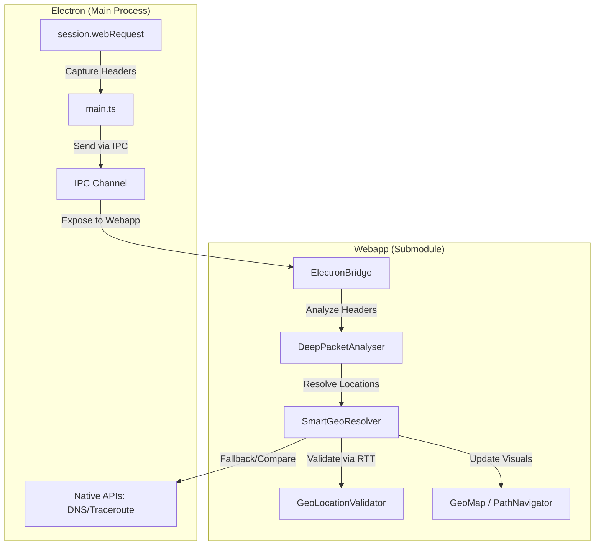

# oli-electron

Electron desktop app for the **o|i CDN Demo** - bypasses browser CORS restrictions and enables native network monitoring.


## Quick Start

```bash
# Clone with submodules
git clone --recursive https://github.com/markminnoye/oli-electron.git
cd oli-electron

# Install dependencies (includes webapp)
npm install

# Start development
npm run dev
```

## Architecture

The Electron app wraps the existing [o-i-demo](https://github.com/markminnoye/o-i-demo) webapp as a **git submodule**. This allows:

- ✅ **CORS Bypass** - No browser security restrictions on HTTP headers
- ✅ **Network Monitoring** - Capture ALL HTTP headers (no CORS limits)
- ✅ **Native APIs** - Traceroute, DNS lookup, system geolocation
- ✅ **Easy Sync** - One command to update: `git submodule update --remote`

## Project Structure

```
oli-electron/
├── app/                    # ← git submodule (o-i-demo)
│   └── app/                # Vite webapp
├── src/main/               # Electron main process
│   ├── main.ts             # Entry point, window creation
│   └── preload.ts          # IPC bridge to webapp
├── docs/                   # Documentation & images
├── package.json            # Electron dependencies
└── electron-builder.yml    # Build configuration
```

## Syncing Webapp Updates

When the webapp (`o-i-demo`) gets new features:

```bash
# Pull latest from webapp repo
git submodule update --remote app

# Commit the update
git add app
git commit -m "chore: sync webapp to latest"
```

## Scripts

| Command | Description |
|---------|-------------|
| `npm run dev` | Start Vite + Electron in development mode |
| `npm run build` | Build webapp + Electron for production |
| `npm run build:electron` | Package Electron app for distribution |

## Development

The dev mode runs:
1. **Vite** dev server at `http://localhost:5173`
2. **Electron** loads the webapp from Vite (with DevTools open)

Network monitoring logs video-related requests (`.m3u8`, `.mpd`, `.ts`, `.m4s`) to the console.

## Implementation Status

- ✅ **Phase 1**: Minimal Electron wrapper (CORS bypass, dev/prod modes)
- ✅ **Phase 2**: Network monitoring (HTTP headers → DeepPacketAnalyser)
- ✅ **Phase 3**: Traceroute & Smart Geolocation Engine
- 🚧 **Phase 4**: Progressive path visualization & real-time hop discovery

## Smart Geolocation Engine

The app implements a multi-source geolocation resolver to accurately locate CDN edge nodes:

1.  **CDN-Specific Headers**: Extracts location codes from `x-amz-cf-pop`, `x-served-by`, `cf-ray`, etc.
2.  **Hostname Parsing**: Reverse DNS analysis for location patterns (e.g., `ams`, `fra`).
3.  **RTT Validation**: Measures round-trip time and compares it against theoretical speed-of-light limits to detect impossible or unlikely geodata.
4.  **Multi-source Fallback**: Bridges data from ip-api, MaxMind (when available), and native Electron capabilities.

### Data Flow Architecture



## Tech Stack

- **Electron** v33 - Desktop framework
- **TypeScript** - Type-safe code
- **Vite** - Fast dev server & bundler
- **concurrently** - Run Vite + Electron together
- **wait-on** - Ensure Vite is ready before Electron starts

## License

MIT
