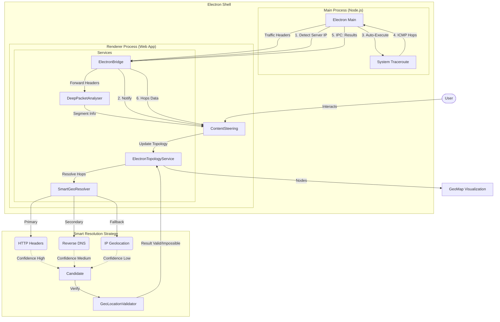
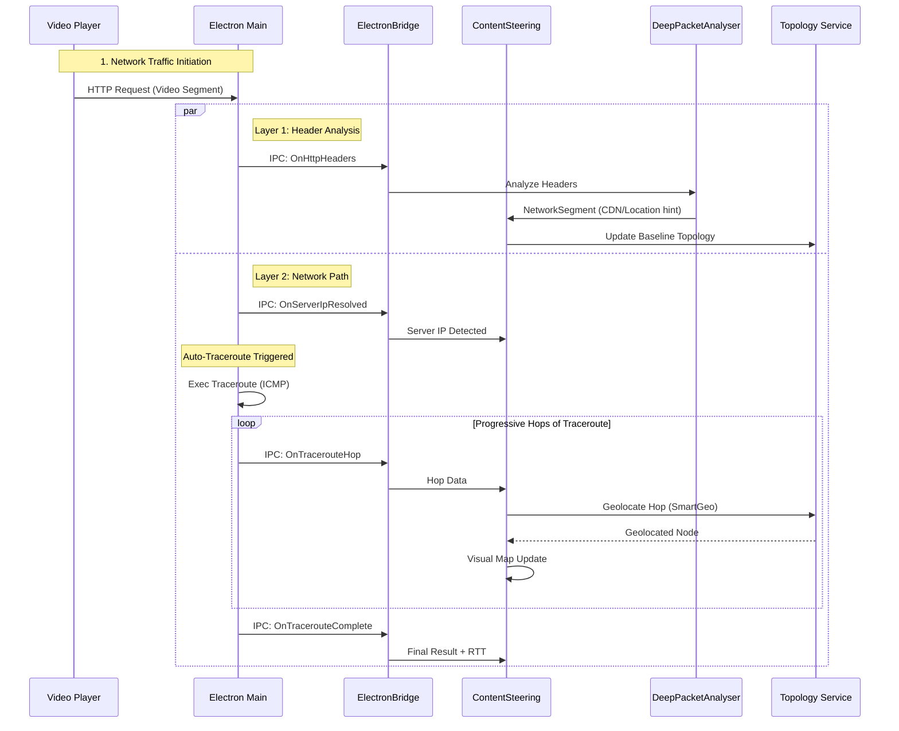
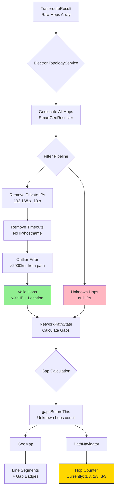

# Smart Geolocation Architecture

## Overview
The Smart Geolocation system addresses the challenge of accurately geolocating network infrastructure, particularly Content Delivery Networks (CDNs). Standard IP geolocation databases often fail with Anycast IPs, returning generic country centers (e.g., "Kansas" for US locations) rather than the actual server location.

This system implements a **multi-source, validated resolution strategy** to ensure the network topology map reflects the user's real physical data path.

## Architecture

This diagram illustrates the data flow from network request to map visualization:



## Process Flow

This sequence diagram details the real-time interaction between the Video Player, Electron Main process, and the Geo Services.



## Data Flow: Traceroute to Visualization

This diagram shows how raw traceroute hops are filtered, geolocated, and displayed in the UI:



**Key Behaviors:**
- **GeoMap**: Shows all valid hops with gap indicators (e.g., "+2 unknown")
- **PathNavigator**: Currently displays position among *valid hops only* (1/3, 2/3, 3/3)
  - Each node stores `hopNumber` property with original traceroute hop number
  - Future enhancement: Display actual hop numbers (1/6, 4/6, 6/6) using `hopNumber` property

**Example Scenario:**
```
Traceroute Result: 6 total hops
├── Hop 1: User ISP (valid) ✅
├── Hop 2: * * * (timeout) ❌
├── Hop 3: * * * (timeout) ❌
├── Hop 4: Transit (valid) ✅
├── Hop 5: * * * (timeout) ❌
└── Hop 6: CDN Edge (valid) ✅

Current Navigator Display: 1/3 → 2/3 → 3/3
Proposed Enhancement: 1/6 → 4/6 → 6/6
```


## Core Components

### 1. SmartGeoResolver
**Role**: Central Intelligence  
**Location**: `src/services/geo/SmartGeoResolver.ts`

This service orchestrates the resolution process. It prioritizes data sources based on reliability:
1.  **HTTP Headers (High Confidence)**: CDNs often self-identify their location in debug headers using **IATA airport codes**.
    *   *AWS CloudFront*: `x-amz-cf-pop` (e.g., "AMS50" → **AMS** → Amsterdam)
    *   *Fastly*: `x-served-by` (e.g., "cache-fra..." → **FRA** → Frankfurt)
    *   *Cloudflare*: `cf-ray` (e.g., "...-LHR" → **LHR** → London)
2.  **Reverse DNS (Medium Confidence)**: Hostnames from traceroute often contain airport codes.
    *   Example: `ae1.3510.ear3.Frankfurt1.level3.net`
3.  **IP Geolocation (Low Confidence)**: Traditional database lookup (MaxMind/IP-API). Used as a baseline fallback.

### 2. GeoLocationValidator (RTT Check)
**Role**: Physics Enforcement  
**Location**: `src/services/geo/GeoLocationValidator.ts`

This component uses the "Speed of Light" constraint to validate locations.
*   **Input**: User Location, Target Location, Measured RTT (Round Trip Time).
*   **Logic**: Calculate the minimum time required for light to travel User→Target→User.
*   **Rule**: If `Measured RTT < Theoretical Min RTT`, the location is **Physically Impossible** and flag is raised.

### 3. DeepPacketAnalyser
**Role**: Header Extraction  
**Location**: `src/services/DeepPacketAnalyser.ts`

Extensions were made to this existing service to parse geolocating headers (`x-amz-cf-pop`, `x-id-shield`, `x-served-by`) from encrypted traffic streams and pass them to the topology engine.

### 4. ElectronTopologyService
**Role**: Topology Builder  
**Location**: `src/services/ElectronTopologyService.ts`

This service constructs the visual graph. It integrates `SmartGeoResolver` result and applies a final **Outlier Filter**:
*   Filters out hops that are >2000km away from both the User AND the Destination (common symptom of Anycast misrouting).

## Debugging

To verify geolocation logic, open the Electron Developer Console. You will see colored logs indicating the resolution source:

> `[SmartGeoResolver] ✅ MATCH (Source: Headers): Amsterdam (Code: AMS)`  
> `[SmartGeoResolver] ✅ MATCH (Source: DNS): Frankfurt (Hostname: ...fra...)`  
> `[SmartGeoResolver] 🟢 RTT VALID: Matches distance (150km)`  
> `[SmartGeoResolver] ⚠️ RTT MISMATCH: Impossible for 8.8.8.8`
