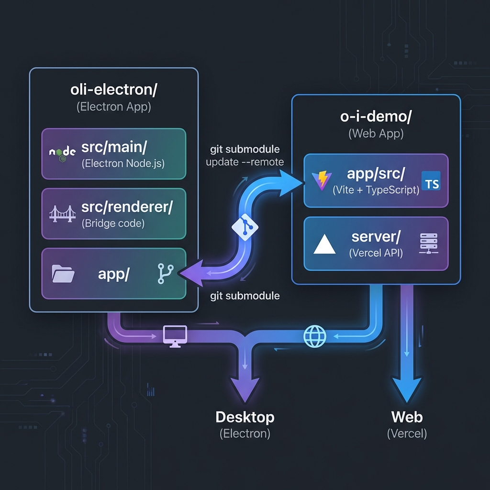

# Electron Desktop App - Requirements & Architecture

## Executive Summary

Transform the existing **o|i CDN Demo** web application into an **Electron desktop app** to bypass browser CORS restrictions and enable comprehensive network monitoring with Node.js capabilities.

## Architecture Overview



> The Electron version lives **alongside** the web version. The webapp (`o-i-demo`) is embedded as a **git submodule**, making it easy to sync updates with a single command: `git submodule update --remote`.


### Existing Stack (oli-demo)
```
oli-demo/
├── app/                    # Vite + TypeScript web app
│   ├── src/
│   │   ├── components/     # UI components (player, metrics, map)
│   │   ├── services/       # API integrations
│   │   ├── types/          # TypeScript definitions
│   │   └── utils/          # Helper functions
│   └── package.json        # Shaka, THEOplayer, Chart.js, Leaflet
│
└── server/                 # Vercel serverless API
    ├── api/                # Backend endpoints
    └── package.json        # Node.js dependencies
```

**Tech Stack**:
- **Players**: THEOplayer, Shaka Player, Video.js
- **Charts**: Chart.js
- **Maps**: Leaflet.js
- **Build**: Vite + TypeScript

**Current Limitations**:
- ❌ CORS restrictions prevent full header access
- ❌ Can't execute system commands (traceroute)
- ❌ Limited network inspection
- ❌ No GPS/native APIs

## Proposed Electron Architecture

```
electron-app/
├── main/                   # Node.js main process
│   ├── main.ts            # Electron entry point
│   ├── network-monitor.ts # HTTP interception
│   ├── system-info.ts     # GPS, IP, traceroute
│   └── ipc-handlers.ts    # Communication bridge
│
├── renderer/              # Chromium renderer process
│   └── (imports from ../app/src)
│
├── shared/                # Shared between main/renderer
│   ├── types.ts          # IPC message types
│   └── constants.ts      # Config
│
└── package.json          # Electron + app dependencies
```

## Functional Requirements

### 1. Network Metrics (Enhanced)

#### Must Have
- **TTFB** (Time to First Byte)
  - Via Resource Timing API
  - Per-segment tracking
  
- **Video Quality Metrics**
  - Real bitrate vs declared bitrate
  - Video resolution and codec
  - Position in ABR ladder
  - Quality switches over time

- **Time to Max Quality**
  - Track ABR progression
  - Measure time to reach highest bitrate

- **TTFF** (Time to First Frame)
  - From play() to first frame rendered
  - Via Performance API

- **Dropped Frames**
  - `video.getVideoPlaybackQuality()`
  - Cumulative count

- **Buffer Health**
  - MSE buffer levels
  - Real-time monitoring

- **Transport Latency (RTT)**
  - Resource Timing API
  - Connection establishment time

- **Download Speed**
  - Calculate from segment size / download time
  - Rolling average

#### Display Requirements
- **Line graphs** (reuse existing Chart.js code)
- **Metric cards** (reuse existing UI components)
- **60-second sliding window**
- **1-second update interval**

### 2. Delivery Path Monitoring

#### Must Have
- **User Location**
  - GPS coordinates (if available)
  - IP-based geolocation fallback
  - City/country display

- **Public IP**
  - Detect via external service (ipify.org)
  - Display in UI

- **Server IP**
  - Extract from video segment URLs
  - DNS lookup via Node.js
  - Track multiple CDN IPs

- **HTTP Headers**
  - Intercept via `session.webRequest`
  - Capture manifest and segment headers
  - Display in expandable panel

- **Traceroute**
  - Execute via `child_process.exec`
  - Parse and visualize hops
  - Show on map

#### Display Requirements
- **Interactive map** (reuse existing Leaflet code)
- **Path visualization** (user → CDN → origin)
- **Hop-by-hop latency**
- **CDN node locations**

## Technical Implementation

### Electron Integration Strategy

#### Phase 1: Minimal Electron Wrapper
**Goal**: Get existing app running in Electron

**Tasks**:
1. Create Electron main process
2. Load existing Vite app in BrowserWindow
3. Disable web security for CORS
4. Test basic functionality

**Files to Create**:
```typescript
// electron-app/main/main.ts
import { app, BrowserWindow } from 'electron';

let mainWindow: BrowserWindow;

app.on('ready', () => {
  mainWindow = new BrowserWindow({
    width: 1920,
    height: 1080,
    webPreferences: {
      webSecurity: false,  // Disable CORS
      nodeIntegration: true,
      contextIsolation: false
    }
  });

  // Load Vite dev server or built app
  mainWindow.loadURL('http://localhost:5173');
});
```

**Success Criteria**:
- ✅ App loads in Electron window
- ✅ Video playback works
- ✅ No CORS errors
- ✅ Existing UI renders correctly

**Estimated Effort**: 4 hours

#### Phase 2: Network Monitoring & Service Integration
**Goal**: Capture HTTP headers and system data, feed into existing services

**Tasks**:
1. Implement `session.webRequest` interceptor for HTTP headers
2. **Feed headers to `DeepPacketAnalyser`** (existing service)
   - Currently uses `xhr.getAllResponseHeaders()`
   - Electron can provide ALL headers (no CORS restrictions)
   - Enhance `DeepPacketAnalyser.analyze()` to accept Electron headers
3. Implement traceroute execution via Node.js
4. **Feed traceroute to `NetworkTopologyService`** (existing service)
   - Parse traceroute hops
   - Convert to `RouteNode[]` format
   - Service already renders on `GeoMap`
5. Implement IP detection (public + server DNS)

**Files to Create**:
```typescript
// electron-app/main/network-monitor.ts
import { session } from 'electron';

export function setupNetworkMonitoring(mainWindow: BrowserWindow) {
  session.defaultSession.webRequest.onHeadersReceived(
    { urls: ['*://*/*'] },
    (details, callback) => {
      // Send ALL headers to renderer (no CORS restrictions!)
      mainWindow.webContents.send('http-headers-captured', {
        url: details.url,
        headers: details.responseHeaders,
        statusCode: details.statusCode,
        method: details.method
      });
      
      callback({ responseHeaders: details.responseHeaders });
    }
  );
}
```

```typescript
// electron-app/main/system-info.ts
import { exec } from 'child_process';
import dns from 'dns';

export async function traceroute(host: string): Promise<TracerouteHop[]> {
  return new Promise((resolve, reject) => {
    exec(`traceroute -m 15 ${host}`, (error, stdout) => {
      if (error) {
        reject(error);
        return;
      }
      
      // Parse traceroute output
      const hops = parseTracerouteOutput(stdout);
      resolve(hops);
    });
  });
}

function parseTracerouteOutput(output: string): TracerouteHop[] {
  // Parse format: "1  gateway (192.168.1.1)  1.234 ms"
  const lines = output.split('\n').slice(1); // Skip header
  return lines.map((line, index) => {
    const match = line.match(/(\d+)\s+(.+?)\s+\(([^)]+)\)\s+([\d.]+)\s+ms/);
    if (match) {
      return {
        hop: parseInt(match[1]),
        hostname: match[2].trim(),
        ip: match[3],
        rtt: parseFloat(match[4])
      };
    }
    return null;
  }).filter(Boolean);
}
```

**Files to Modify**:
```typescript
// app/src/services/DeepPacketAnalyser.ts
// Add new method to accept Electron headers (bypasses XHR limitations)

public analyzeFromElectron(
  url: string,
  headers: Record<string, string[]>,
  ttfb: number,
  timestamp: number,
  requestType: 'Manifest' | 'Segment',
  throughput?: number
) {
  // Same logic as analyze(), but use headers directly
  // No need for getSafeHeader() - we have ALL headers!
  
  const allHeaders = {
    server: headers['server']?.[0],
    xCDN: headers['x-cdn']?.[0],
    xAmzCfPop: headers['x-amz-cf-pop']?.[0],
    via: headers['via']?.[0],
    xServedBy: headers['x-served-by']?.[0],
    xIdShield: headers['x-id-shield']?.[0],
    // ... all headers available!
  };
  
  // Continue with existing CDN detection logic
}
```

```typescript
// app/src/services/NetworkTopologyService.ts
// Add new method to integrate traceroute data

public static resolveTopologyWithTraceroute(
  user: UserLocation,
  segment: NetworkSegment,
  tracerouteHops: TracerouteHop[]
): RouteNode[] {
  // Existing logic PLUS
  // Insert actual traceroute hops between ISP and CDN
  
  const nodes = this.resolveTopology(user, segment);
  
  // Inject real hops from traceroute
  if (tracerouteHops.length > 0) {
    // Replace theoretical ISP transit with actual hops
    const realHops = tracerouteHops.map((hop, i) => ({
      id: `hop-${i}`,
      label: `${hop.hostname} (${hop.rtt}ms)`,
      coords: [/* geolocate hop.ip */],
      type: 'isp' as const
    }));
    
    // Insert between user and CDN
    nodes.splice(2, 0, ...realHops);
  }
  
  return nodes;
}
```

**Success Criteria**:
- ✅ All HTTP headers captured (no CORS limits)
- ✅ Headers fed to `DeepPacketAnalyser`
- ✅ Traceroute executes successfully
- ✅ Traceroute hops rendered on `GeoMap`
- ✅ Server IPs detected via DNS
- ✅ Public IP detected

**Estimated Effort**: 10 hours

#### Phase 3: IPC Bridge & Integration Testing
**Goal**: Connect Electron main process to renderer services

**Tasks**:
1. Set up IPC handlers in main process
2. Set up IPC listeners in renderer
3. Wire up header capture → `DeepPacketAnalyser`
4. Wire up traceroute → `NetworkTopologyService`
5. Test end-to-end flow
6. Performance optimization

**IPC Communication Pattern**:
```typescript
// Renderer (app/src/main.ts or similar)
import { ipcRenderer } from 'electron';

// Listen for headers from Electron
ipcRenderer.on('http-headers-captured', (event, data) => {
  const { url, headers, statusCode } = data;
  
  // Feed to existing service
  const analyser = DeepPacketAnalyser.getInstance();
  analyser.analyzeFromElectron(url, headers, ttfb, Date.now(), 'Manifest');
});

// Request traceroute when stream starts
function onStreamStart(streamUrl: string) {
  const hostname = new URL(streamUrl).hostname;
  ipcRenderer.send('run-traceroute', hostname);
}

// Receive traceroute results
ipcRenderer.on('traceroute-result', (event, hops) => {
  // Feed to topology service
  const topology = NetworkTopologyService.resolveTopologyWithTraceroute(
    userLocation,
    currentSegment,
    hops
  );
  
  // Existing GeoMap will render it
  geoMap.updateTopology({ nodes: topology });
});
```

**Success Criteria**:
- ✅ Headers flow from Electron → `DeepPacketAnalyser`
- ✅ Traceroute flows from Electron → `NetworkTopologyService` → `GeoMap`
- ✅ All existing UI components work unchanged
- ✅ No performance degradation
- ✅ Metrics displayed correctly

**Estimated Effort**: 6 hours

### Code Reuse Strategy

#### Shared Components (No Changes Needed)
- ✅ `app/src/components/player/*` - Video players
- ✅ `app/src/components/metrics/*` - Metric cards
- ✅ `app/src/components/visualization/*` - Charts
- ✅ `app/src/components/ui/*` - UI components
- ✅ `app/src/styles/*` - CSS

#### Enhanced Components (Minor Changes)
- ⚠️ `DeliveryPathMap.ts` - Add IPC listeners for traceroute
- ⚠️ `MetricsPanel.ts` - Add header inspection panel
- ⚠️ `main.ts` - Add Electron-specific initialization

#### New Components (Electron-specific)
- 🆕 `HeaderInspector.ts` - Display HTTP headers
- 🆕 `TraceroutePanel.ts` - Show traceroute results
- 🆕 `SystemInfo.ts` - Display GPS, public IP

### Build Configuration

```json
// electron-app/package.json
{
  "name": "oi-cdn-monitor",
  "version": "1.0.0",
  "main": "dist/main/main.js",
  "scripts": {
    "dev": "concurrently \"npm run dev:vite\" \"npm run dev:electron\"",
    "dev:vite": "cd ../app && npm run dev",
    "dev:electron": "electron .",
    "build": "npm run build:vite && npm run build:electron",
    "build:vite": "cd ../app && npm run build",
    "build:electron": "tsc && electron-builder"
  },
  "dependencies": {
    "electron": "^28.0.0"
  },
  "devDependencies": {
    "electron-builder": "^24.0.0",
    "concurrently": "^8.0.0"
  }
}
```

## Success Criteria

### Phase 1 (Minimal Wrapper)
- ✅ Electron app launches
- ✅ Existing web app loads
- ✅ No CORS errors
- ✅ Video playback works

### Phase 2 (Network Monitoring)
- ✅ HTTP headers captured
- ✅ Server IPs detected
- ✅ Traceroute executes
- ✅ Public IP detected
- ✅ GPS location (if available)

### Phase 3 (UI Integration)
- ✅ All metrics displayed
- ✅ Headers shown in UI
- ✅ Traceroute on map
- ✅ Server IPs on map
- ✅ Graphs working
- ✅ No performance degradation

## Risks & Mitigations

| Risk | Impact | Mitigation |
|------|--------|------------|
| Electron bundle size too large | Medium | Use electron-builder optimization |
| Performance degradation | High | Profile and optimize IPC calls |
| Platform-specific issues (traceroute) | Medium | Detect OS and use appropriate command |
| GPS not available on desktop | Low | Fall back to IP geolocation |
| Build complexity | Medium | Use electron-builder templates |

## Development Timeline

### Week 1: Phase 1 (Minimal Wrapper)
- Day 1-2: Electron setup, basic window
- Day 3: Load existing app, test playback
- Day 4: Fix CORS, test all features

### Week 2: Phase 2 (Network Monitoring)
- Day 1-2: HTTP header interception
- Day 3: Traceroute implementation
- Day 4: IP detection (public + server)
- Day 5: IPC communication setup

### Week 3: Phase 3 (UI Integration)
- Day 1-2: Update map with traceroute
- Day 3: Header inspection panel
- Day 4: Server IP visualization
- Day 5: Testing and polish

**Total Estimated Effort**: 15 days (3 weeks)

## Next Steps

1. **Create electron-app directory structure**
2. **Set up Electron main process**
3. **Test loading existing app**
4. **Implement Phase 1 (minimal wrapper)**
5. **Verify all existing features work**
6. **Proceed to Phase 2 (network monitoring)**

---

**Status**: Ready to start Phase 1
**Repository**: `/Users/markminnoye/git/oli-demo`
**Next Action**: Create `electron-app/` directory and basic Electron setup
